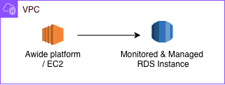
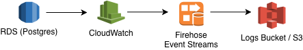

Table of Contents
=================

- [Overview](#overview)
- [Additional Documentation](#additional-documentation)
- [Configuration](#configuration)
  - [1. Make sure Awide Suite Agent can connect to RDS Instance / EC2 to RDS connection](#1--make-sure-awide-suite-agent-can-connect-to-rds-instance--ec2-to-rds-connection)
    - [1.1 Make sure Awide Suite Agent can connect to RDS Instance](#11-make-sure-awide-suite-agent-can-connect-to-rds-instance)
    - [1.2 Configuring the connection](#12-configuring-the-connection)
  - [2. Extended analytics](#2-extended-analytics)
    - [2.1 Create Firehose delivery stream](#21-create-firehose-delivery-stream)
    - [2.2 Create IAM role](#22-create-iam-role)
    - [2.3 Configure Firehose subscription filter](#23-configure-firehose-subscription-filter)
    - [2.4 Verification](#24-verification)
    - [2.5 Summary of Created Resources](#25-summary-of-created-resources)


## Overview
This guide provides step-by-step instructions to configure streaming of RDS PostgreSQL logs from Amazon CloudWatch to an S3 bucket using Amazon Data Firehose. This setup enables Awide PostgreSQL Suite to access RDS logs for extended analytics capabilities. The pipeline consists of three components:


> Note:
This guide assumes that the RDS PostgreSQL instance is already configured to publish logs to CloudWatch Logs. If not, please refer to the official AWS documentation to set up log publishing before proceeding with this guide, or refer to the additional documentation section below for more details.


## Additional Documentation
For troubleshooting, and best practices you may want to refer to the official AWS documentation:
1. Publishing PostgreSQL logs to Amazon CloudWatch Logs https://docs.aws.amazon.com/AmazonRDS/latest/UserGuide/USER_LogAccess.Concepts.PostgreSQL.html#USER_LogAccess.Concepts.PostgreSQL.PublishtoCloudWatchLogs
2. Sending CloudWatch Logs to Firehose: https://docs.aws.amazon.com/firehose/latest/dev/writing-with-cloudwatch-logs.html
3. Cross-account subscriptions and Firehose integration: https://docs.aws.amazon.com/AmazonCloudWatch/latest/logs/CrossAccountSubscriptions-Firehose.html.


---

# Configuration 

# 1.  Make sure Awide Suite Agent can connect to RDS Instance / EC2 to RDS connection
## Goal
The guide describes how to make sure that Awide Suite Agent can connect to the target RDS PostgreSQL instance and how to configure the required connection if it is not the case.



## Prerequisites

Collect the following values before starting. They are referenced throughout this guide.

| Parameter | Description | Example |
|---|---|---|
| Target RDS instance identifier (not the endpoint hostname). `<TARGET_RDS_INSTANCE_ID>` | Identifier of the target RDS PostgreSQL instance | `rds-database.cyv2g8y2armk.us-east-1.rds.amazonaws.com` |
| Target RDS instance port `<TARGET_RDS_INSTANCE_PORT>` | Port of the target RDS PostgreSQL instance | `5432` |


## 1.1 Make sure Awide Suite Agent can connect to RDS Instance

Access the EC2 shell (for example, via AWS Systems Manager) and make sure that Awide Suite Agent is able to reach out to RDS PostgreSQL port (e.g. `<TARGET_RDS_INSTANCE_PORT>`).
For instance, it can be done by the standard telnet tool:
```bash
$ telnet rds-database.cyv2g8y2armk.us-east-1.rds.amazonaws.com 5432
Trying 10.0.2.174...
Connected to rds-database.cyv2g8y2armk.us-east-1.rds.amazonaws.com.
Escape character is '^]'.
```
It guarantees that Awide Suite Agent is able to connect to the RDS PostgreSQL port. 

If the connection is unsuccessful then it is vital to allow the agent environment (EC2) to connect to the required RDS Instance `<TARGET_RDS_INSTANCE_ID>`
##  1.2 Configuring the connection

Note: Awide PostgreSQL Suite doesn't manage connectivity between its running EC2 and the target RDS Instance.
Product user can configure the required connection by applying their specific company rules and/or practices. For example, the connectivity can be confired by following the following documentation:
- https://docs.aws.amazon.com/AmazonRDS/latest/UserGuide/ec2-rds-connect.html 

---

# 2. Extended analytics
## Goal
The guide describes how to configure streaming of RDS PostgreSQL logs from Amazon CloudWatch to an S3 bucket using Amazon Data Firehose. The pipeline consists of three components:

1. **Amazon Data Firehose delivery stream** — receives log records from CloudWatch and writes them to S3.
2. **IAM role** — grants CloudWatch Logs permission to put records into the Firehose stream.
3. **CloudWatch Logs subscription filter** — routes log events from the RDS log group to the Firehose stream.



Sequentially, the data flows through the pipeline as follows:
```
RDS PostgreSQL  →  CloudWatch Log Group  →  Firehose Delivery Stream  →  S3 Bucket → Awide PostgreSQL Suite Analytics
```

## Prerequisites

Collect the following values before starting. They are referenced throughout this guide.

| Parameter | Description | Example |
|---|---|---|
| `<S3_BUCKET_NAME>` | S3 bucket created by the AWIDE Suite CloudFormation stack. <br/><br/> **Value can be found in the CloudFormation stack outputs under `S3LogsBucketName` parameter.** |   `awide-suite-logs-bucket-770565308889-us-east-1` |
|`<FIREHOSE_IAM_ROLE>`| ARN of the IAM role used by Firehose to write logs data to S3. <br/><br/> **Value can be found in the CloudFormation stack outputs under `FirehoseIAMRoleArn` parameter.** | `awide-suite-FirehoseIAMRole-n5bbrVUfMbTv`  |
| `<AWS_REGION>` | AWS region where Awide PostgreSQL Suite is deployed | `us-east-1` |
| `<TARGET_RDS_INSTANCE_ID>` and `<TARGET_RDS_INSTANCE_PORT>` | Identifier and port of the target RDS PostgreSQL instance  | `rds-database.cyv2g8y2armk.us-east-1.rds.amazonaws.com` and `5432` |
| `<AWS_ACCOUNT_ID>` | 12-digit AWS account ID (your AWS account) | `939462555555` |
| `<FIREHOSE_DELIVERY_STREAM_NAME>`| Name of the Firehose stream. <br/><br/> **Will be created by the user in the step 2.1** |  `PUT-rds-database-stream` | 
| `<CLOUDWATCH_FIREHOSE_IAM_ROLE_NAME>`| Name of the IAM role used by CloudWatch to write logs to Firehose | `CloudWatchToFirehoseRole` |

> **Note:** The S3 bucket name and RDS instance identifier are available in the CloudFormation stack outputs.


## 2.1 Create Firehose delivery stream

The stream receives log records from CloudWatch and writes them to S3. During the stream creation, you will specify the S3 bucket as the destination and grant Firehose permission to write to it using the IAM role created by the CloudFormation stack.

1. Open the **AWS Management Console** and navigate to **Amazon Data Firehose**.
2. Click **Create Firehose stream**.
3. Configure the stream with the following settings:

   | Setting | Value |
   |---|---|
   | **Source** | `Direct PUT` |
   | **Stream name** | `<FIREHOSE_DELIVERY_STREAM_NAME>` (e.g., `PUT-rds-database-stream`) |
   | **Destination** | `Amazon S3` |
   | **S3 bucket** | `<S3_BUCKET_NAME>` (e.g., `awide-suite-logs-bucket-770565308889-us-east-1`) |
   | **S3 prefix** | `<TARGET_RDS_INSTANCE_ID>/<TARGET_RDS_INSTANCE_PORT>/` (e.g., `rds-database/5432/`) |
   | **S3 error output prefix** | `<TARGET_RDS_INSTANCE_ID>/<TARGET_RDS_INSTANCE_PORT>/errors/` (e.g., `rds-database/5432/errors/`) |
   | **Buffer size** | `1` MiB |
   | **Buffer interval** | `60` seconds |
   | **File extension** | `.gz` |
   | **Compression for data records** | `Not enabled` |
   | **Service access**| `Choose existing IAM role` → `Existing IAM roles` →  Choose `<FIREHOSE_IAM_ROLE> e.g. "awide-suite-FirehoseIAMRole-n5bbrVUfMbTv" `  |

4. Leave all other settings at their defaults and click **Create Firehose stream**.
5. Wait until the stream status changes to **Active**.

> **Record the ARN** of the created stream — it is required in the next step. The ARN has the format:
> `arn:aws:firehose:<AWS_REGION>:<AWS_ACCOUNT_ID>:deliverystream/<FIREHOSE_DELIVERY_STREAM_NAME>`

---


## 2.2 Create IAM role

Create an IAM role that allows CloudWatch Logs to put records into the Firehose stream.

Name: `<CLOUDWATCH_FIREHOSE_IAM_ROLE_NAME>` (e.g., `CloudWatchToFirehoseRole`)

**Trust policy** (used when creating the role):
```json
{
    "Version": "2012-10-17",
    "Statement": [
        {
            "Effect": "Allow",
            "Principal": {
                "Service": "logs.amazonaws.com"
            },
            "Action": "sts:AssumeRole"
        }
    ]
}
```

**Permissions policy** (attached as an inline policy to the role):
```json
{
    "Version": "2012-10-17",
    "Statement": [
        {
            "Effect": "Allow",
            "Action": [
                "firehose:PutRecord",
                "firehose:PutRecordBatch"
            ],
            "Resource": "arn:aws:firehose:<AWS_REGION>:<AWS_ACCOUNT_ID>:deliverystream/<FIREHOSE_DELIVERY_STREAM_NAME>"
        }
    ]
}
```

## 2.3 Configure Firehose subscription filter

During this step, a subscription filter is created to route RDS instance logs to the S3 bucket via the created Firehose stream.

1. Navigate to **CloudWatch → Log Management → Log groups**.
2. Find the log group for the RDS instance. The name of Log Group that corresponds to the required Log Group is always uniqie and follows user specific naming connventions.
Hovewer, In the most of cases PostgreSQL log groups follow the naming pattern:
   `/aws/rds/instance/<TARGET_RDS_INSTANCE_ID>/postgresql`
   (e.g., `/aws/rds/instance/rds-database/postgresql`), of fall under the  precreated `RDSOSMetrics` group.
3. Open the required log group, click the **Actions** dropdown, and select **Create Amazon Data Firehose subscription filter**.
4. Configure the subscription filter:

   | Setting | Value | Example |
   |---|---|---|
   | **Destination account** | `Current account` (by default) | |
   | **Amazon Data Firehose stream** | Select the stream created in Step 2.1 e.g.,  | `PUT-rds-database-stream` | 
   | **Grant permission → Select an existing role** | Select the role created in Step 2.2 | `CloudWatchToFirehoseRole` |
   | **Log format** | Common Log Format | 
   | **Subscription filter pattern** | *(make it empty to forward all log events)* |
   | **Subscription filter name** | Any descriptive name | `ForwardToFirehose` |

5. Click **Start streaming** to activate the filter.

---

## 2.4 Verification

After the subscription filter is active, verify the pipeline end-to-end:

1. In **CloudWatch → Log groups**, confirm the subscription filter appears under the RDS log group.
2. Wait at least 60 seconds (the Firehose buffer interval) for data to be flushed to S3.
3. Navigate to the **S3 bucket** and confirm that objects are appearing under the prefix `<TARGET_RDS_INSTANCE_ID>/<TARGET_RDS_INSTANCE_PORT>/`.
4. Optionally, in **Amazon Data Firehose**, open the delivery stream and check the **Monitoring** tab for incoming and outgoing record counts. Make sure the error count is zero.

---

## 2.5 Summary of Created Resources

| Resource | Parameter | Example |
|---|---|---|
| Firehose delivery stream | `<FIREHOSE_DELIVERY_STREAM_NAME>` | `PUT-rds-database-stream` |
| CloudWatch-to-Firehose IAM role | `<CLOUDWATCH_FIREHOSE_IAM_ROLE_NAME>` | `CloudWatchToFirehoseRole` |
| CloudWatch Logs subscription filter | *(user-defined name)* | `ForwardToFirehose` |


